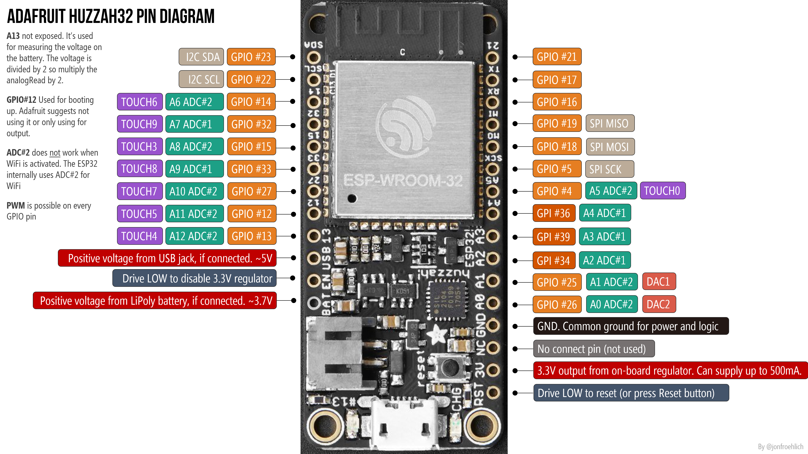
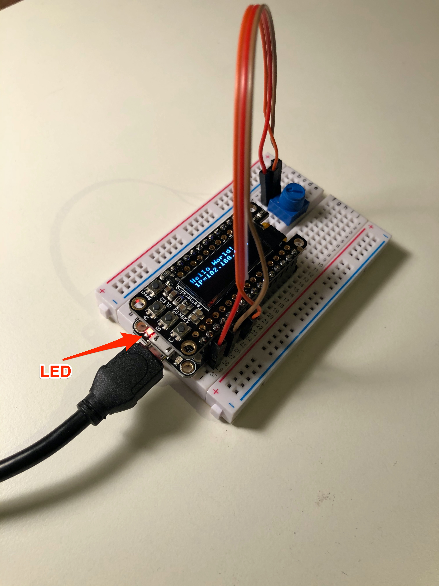
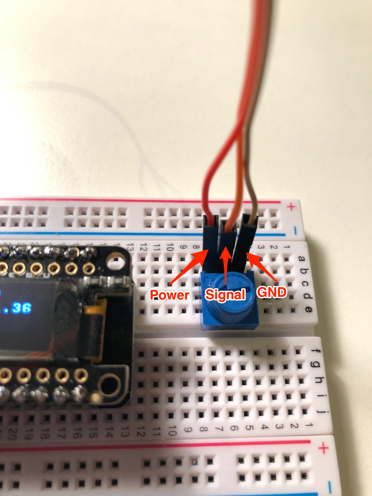
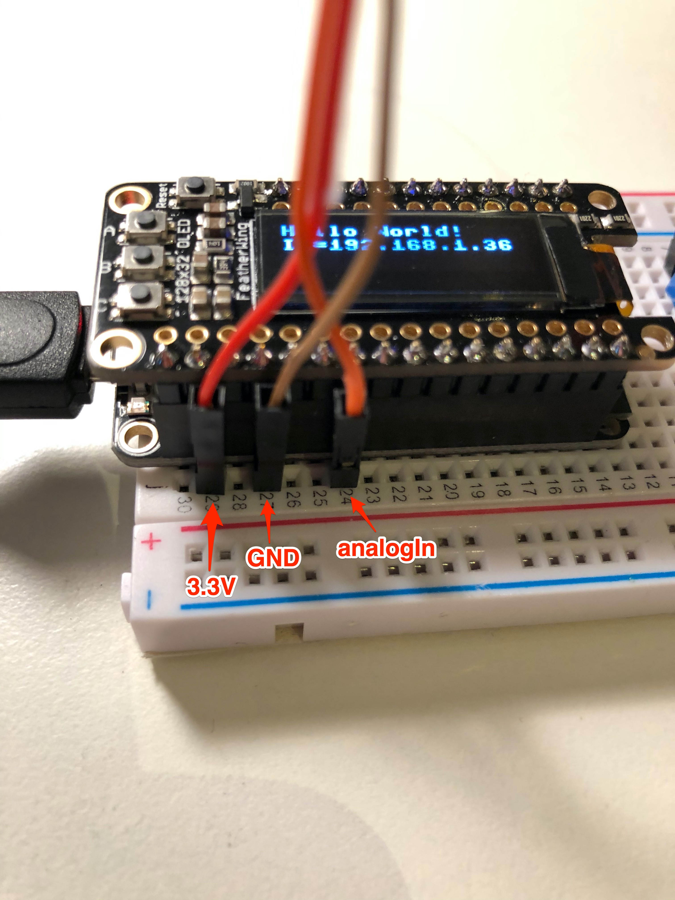

# Using Python with Sensors and Actuators

## Adafruit Huzzah32 Pin Out

Diagram: [Adafruit](https://learn.adafruit.com/adafruit-huzzah32-esp32-feather/pinouts)

Diagram: [Jon Froehlich](https://makeabilitylab.github.io/physcomp/esp32/esp32.html)

Top row:

-   **13** - This is GPIO \#13. It's also connected to the red LED next to the USB port
-   **12** - This is GPIO \#12. This pin has a pull-down resistor built into it, we recommend using it as an output only, or making sure that the pull-down is not affected during boot.
-   **27** - This is GPIO \#27
-   **33** - This is GPIO \#33. It can also be used to connect a 32 KHz crystal.
-   **15** - This is GPIO \#15
-   **32** - This is GPIO \#32. It can also be used to connect a 32 KHz crystal.
-   **14** - This is GPIO \#14

Bottom row:

-   **A0** - An analog output DAC2. It can also be used as a GPIO \#26
-   **A1** - An analog output DAC1. It can also be used as a GPIO \#25
-   **A2** - GPI \#34. Analog Input - Note it is *not* an output-capable pin!
-   **A3** - GPI \#39. Analog Input - Note it is *not* an output-capable pin!
-   **A4** - GPI \#36. Analog Input - Note it is *not* an output-capable pin!
-   **A5** - GPIO \#4
-   **21** - GPIO \#21

## Coding in Python

Using Python for microcontrollers is similar to using C in the Arduino IDE, and you can structure your code in a similar way, with a section for "setup" and a section for the event "loop".

### Blink an LED

Arduino "C" example:

    // the setup function runs once when you press reset or power the board
    void setup() {
      // initialize digital pin LED_BUILTIN as an output.
      pinMode(LED_BUILTIN, OUTPUT);
    }

    // the loop function runs over and over again forever
    void loop() {
      digitalWrite(LED_BUILTIN, HIGH);   // turn the LED on (HIGH is the voltage level)
      delay(1000);                       // wait for a second
      digitalWrite(LED_BUILTIN, LOW);    // turn the LED off by making the voltage LOW
      delay(1000);                       // wait for a second
    }

A similar program in Python [blink.py](../examples/blink.py)

    import machine
    import time

    #setup
    led = machine.Pin(13, machine.Pin.OUT) # LED on the board

    #loop
    while True:
      if led.value() == 0:
        led.value(1)
      else:
        led.value(0)
      time.sleep(1.0)

#### Read Analog Input (ADC) - [analog_read.py](../examples/analog_read.py)

[For more information on ADC on the ESP32](https://docs.micropython.org/en/latest/esp32/quickref.html#adc-analog-to-digital-conversion)

    import machine
    import time

    adc = machine.ADC(machine.Pin(34))
    adc.atten(machine.ADC.ATTN_11DB)

    while True:
      print(adc.read())
      time.sleep_ms(200)

#### Read Analog Input and Switch LED - [read_and_switch.py](../examples/read_and_switch.py)

    import machine
    import time

    adc = machine.ADC(machine.Pin(34))
    adc.atten(machine.ADC.ATTN_11DB) # provides full range of 0-4095

    led = machine.Pin(13, machine.Pin.OUT) # LED on the board

    while True:
      value = adc.read() # reads in the range of 0-4095
      if value > 2048:
        led.value(1)
      else:
        led.value(0)
      print(value)
      time.sleep_ms(200)
