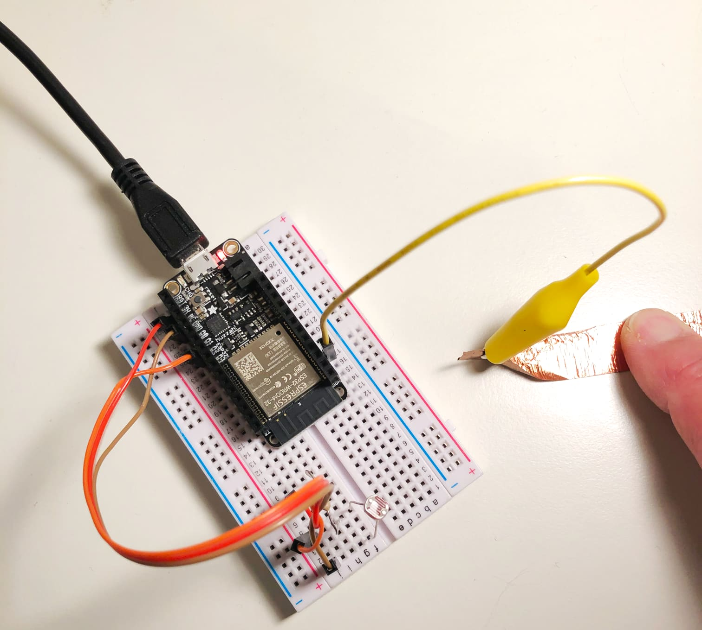

# Capacitive Touch

The ESP32 comes with some Pins capable of sensing touch without any extra hardware. More info in the MicroPython documentation:

https://docs.micropython.org/en/latest/esp32/quickref.html#capacitive-touch

## Capacitive Touch Configured Pins
Purple Pins 4, 12, 13, 14, 15, 27, 32, 33


Diagram: [Jon Froehlich](https://makeabilitylab.github.io/physcomp/esp32/esp32.html)

## Wiring
Connect your touch pad wire to the Pin you select from the above. In this example, we're using Pin(14). The other parts (not used in this example) are for a light sensing photo resistor connected to 3.3V, GND, and Pin(34).


## Example code

Note that a capacitive touch Pin will return **lower values** when the sensor IS touched. In this test, it returned values near the following:

- **untouched: ~465**
- **touched: ~80**

[touch.py](../examples/touch.py)

```Python
from machine import TouchPad, Pin
import time

# set up the touch Pin
t = TouchPad(Pin(14))
# set up the LED output for the built-in LED
led_pin = Pin(13, Pin.OUT) # LED on the board

delay = 0.2

while True:
    touched = t.read() # Returns a smaller number when touched
    print(touched)
    if touched < 110: # when touched, turn on the LED
      led_pin.value(1)
    else:
      led_pin.value(0)
    time.sleep(delay)```
