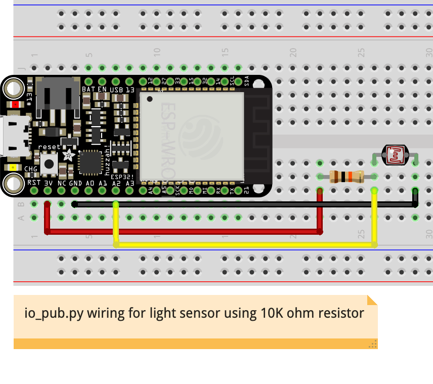
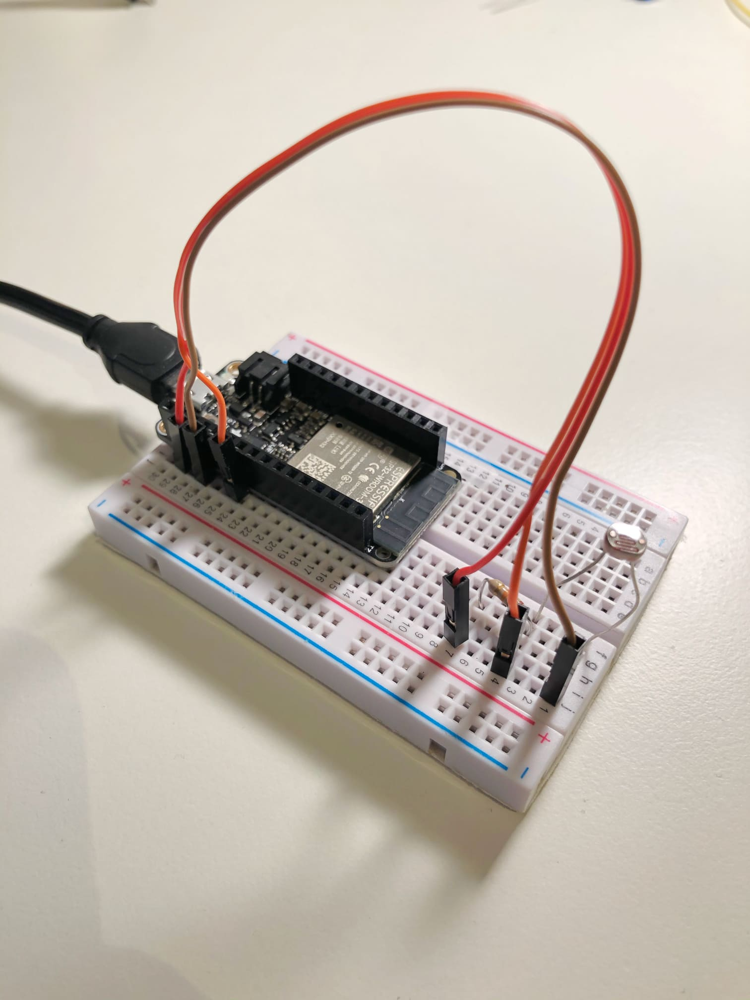
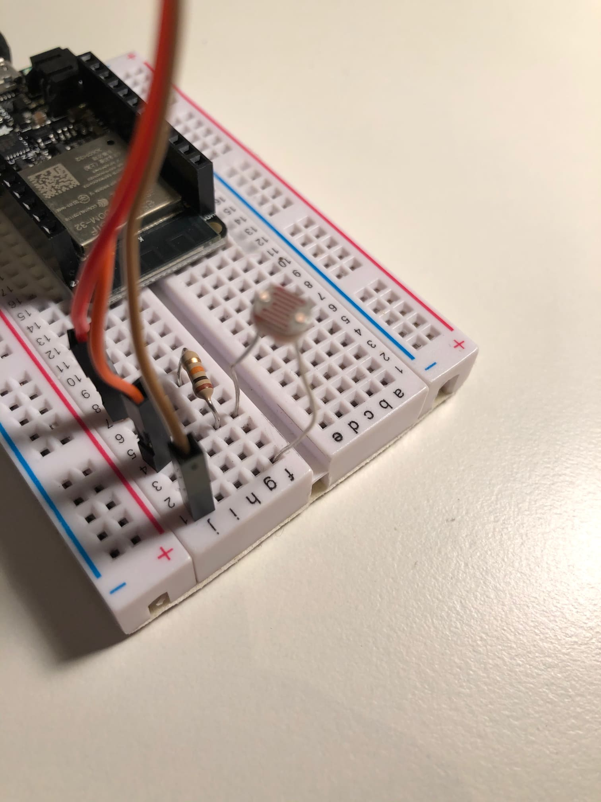
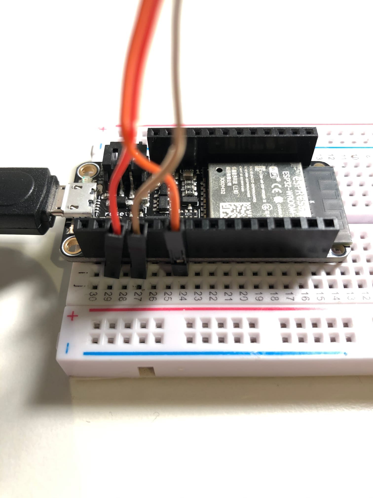

## Using io.adafruit.com Cloud IoT Service with photocell light sensor

We can turn the ESP32 into a cloud connected device that can be controlled from anywhere in the world by using an IoT cloud service like [io.adafruit.com](https://io.adafruit.com/).

1.  Set up your free account on [io.adafruit.com](https://io.adafruit.com/)
1.  Go to IO -> Feeds, and check the box next to "Welcome Feed" and delete it with "**Delete Feed**"
1.  Now, create a new Feed (e.g. named "test")
1.  In the main menu, select "My Key" and get your username and key (copy the code for "Scripting" which is Python)
1.  Enter this information into the code examples where appropriate, replacing the placeholders
1.  Change the myMqttClient in the code to a unique name for each different client you run simultaneously (e.g. your first and last name). If you use the same name (as yourself, or other people) for simultaneous connections to io.adafruit.com, you will get errors.
1.  You should already be connecting to WiFi through your boot.py

### Install MQTT library/module on your device
Before you can run the below example programs, you must install an MQTT library/nodule on your device. You use the upip command to install Python modules in Microphyhon which requires that WiFi be connected. So be sure you have uploaded the boot.py file customized with your WiFi credentials. **You only need to install this library/nodule once**.

Run the following commands to connect to WiFi and install the micropython mqtt module.

To do this, you MUST already be connected to wifi

```
>>> import boot
>>> boot.connect()
>>> import upip
>>> upip.install("micropython-umqtt.simple")
```

### Code Examples

For these examples, you must replace the placeholders for the adafruit username and key, as well as set your own unique value for the client name. Do this in the following section of code:

```Python
#
# configuration from io.adafruit.com
#
ADAFRUIT_IO_USERNAME = "enter an Adafruit Username here"  # can be found at "My Account" at adafruit.com
ADAFRUIT_IO_KEY = "enter an Adafruit IO Key here"  # can be found by clicking on "MY KEY" when viewing your account on io.adafruit.com

# only one program with the same MqttClient Name can access the Adarfuit service at a time
myMqttClient = "your_unique_id" # replace with your own client name unique to you and this code
adafruitFeed = ADAFRUIT_IO_USERNAME + "/feeds/test" # replace "test" with your feed name
adafruitIoUrl = "io.adafruit.com"
```

#### [io_sub.py](../examples/io_sub.py)

Run this program and then go to your io.adafruit.com feed to add a data item to a feed called "test". Each time you add a new data item, it will show up on your device. This is because this program "subscribes" to that particular feed, and gets notified each time it changes.

#### [io_pub.py](../examples/io_pub.py)

Run this program to continuously send values from an analog input to the cloud. Then go to your io.adafruit.com dashboard and watch the values arrive in the feed called "test". This program assume you have an analog sensor connected to Pin 34 (A2). [See this page](basics.md) for more details about which pins are capable of analog input using ADC.

This example uses a light sensor for the analog input, where the photocell is part of a voltage divider made with a 10K ohm resistor.


<br>

<br>



#### [io_pubsub.py](../examples/io_pubsub.py)

This code both publishes and is subscribed to the cloud. Each time it sends a value to the cloud, it is immediately notified that a change happened for that feed. This simulates how you might set up two different devices, where one publishes, and the other subscribes to the same feed. This way, they can communicate to each other from any location.

#### [io_sub_mult.py](../examples/io_sub_mult.py)

This example shows how to access multiple feeds in one program. [Documentation for io_sub_mult.py](io-adafruit-mult.md).
