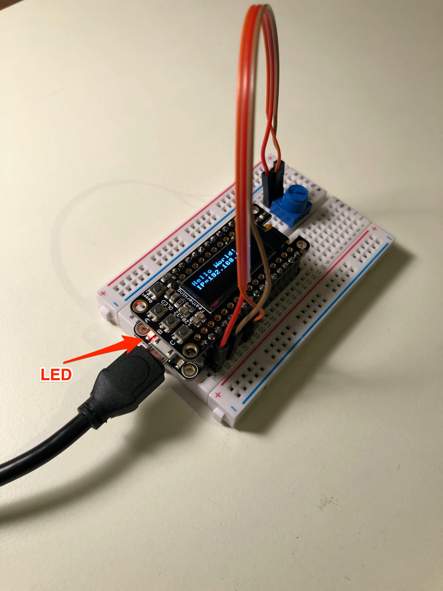

# Using an OLED displays

Because the Huzzah32 is in the Adafruit Feather form factor, you can plug in a Feather OLED display and use it with MicroPython (or [Arduino]( https://youtu.be/5qxQheanSkQ)). In this example, we see the [Adafruit FeatherWing OLED 128x32](https://www.adafruit.com/product/2900) display. You can also use the 128x64 pixel version with these examples (adjusting the dimensions in the setup step).


## I2C Connection

The display connects to the Huzzah32 by I2C pins: scl Pin(22), sda Pin(23)

## SSD1306 OLED library

These examples depend on a MicroPyhon module (ssd1306.py) for the display which can be found here:

https://github.com/micropython/micropython/tree/master/drivers/display

You must put the ssd1306.py file on the Huzzah32 for the following code to work

## OLED code Example 1 - Display text and line

**[oled_simple.py](../examples/oled_simple.py)**

```python
import time
import machine
import ssd1306 # https://github.com/micropython/micropython/tree/master/drivers/display

# set up I2C
i2c = machine.I2C(scl=machine.Pin(22), sda=machine.Pin(23))

# the ssd1306 module uses framebuf from MicroPyhon
# https://docs.micropython.org/en/latest/library/framebuf.html?highlight=framebuf
# for setting the "color" of elements in the display:
# 0 = black, 1 = white
# create the oled object with the 128x32 dimesions of the display at I2C address 0x3c
oled = ssd1306.SSD1306_I2C(128, 32, i2c, 0x3c)

oled.fill(0) # wipe the display with black
oled.text('Hello World!', 0, 0) # put some text on the screen at position 0,0, default to white
oled.hline(0, 10, 128, 1) # create a horizontal line of width 128, starting at position 0,10, with color white
oled.show() # show what's been written to the display
```

## OLED Code Example 2 - Show ip address
**[oled_showip.py](../examples/oled_showip.py)**
```Python
import time
import machine
import network
import ssd1306 # https://github.com/micropython/micropython/tree/master/drivers/display

# set up I2C
i2c = machine.I2C(scl=machine.Pin(22), sda=machine.Pin(23))

# the ssd1306 module uses framebuf from MicroPyhon
# https://docs.micropython.org/en/latest/library/framebuf.html?highlight=framebuf
# for setting the "color" of elements in the display:
# 0 = black, 1 = white
# create the oled object with the 128x32 dimesions of the display at I2C address 0x3c
oled = ssd1306.SSD1306_I2C(128, 32, i2c, 0x3c)

sta_if = network.WLAN(network.STA_IF)
ipaddress = sta_if.ifconfig()[0] # assumes device is already connected to WiFi

oled.fill(1) # wipe the display with white
oled.text('IP='+ipaddress, 0, 0,0) # put ip address on the screen at position 0,0, white
oled.show() # show what's been written to the display
```
## OLED Code Example 3 - Show ADC value graphically
**[oled_analog_read.py](../examples/oled_analog_read.py)**
```Python
import time
import machine
import network
import ssd1306 # https://github.com/micropython/micropython/tree/master/drivers/display

# set up I2C
i2c = machine.I2C(scl=machine.Pin(22), sda=machine.Pin(23))

# the ssd1306 module uses framebuf from MicroPyhon
# https://docs.micropython.org/en/latest/library/framebuf.html?highlight=framebuf
# for setting the "color" of elements in the display:
# 0 = black, 1 = white
# create the oled object with the 128x32 dimesions of the display at I2C address 0x3c
oled = ssd1306.SSD1306_I2C(128, 32, i2c, 0x3c)

# analog to digital input
# https://docs.micropython.org/en/latest/esp32/quickref.html#adc-analog-to-digital-conversion
adc = machine.ADC(machine.Pin(34)) # A2
adc.atten(machine.ADC.ATTN_11DB) # set up range for max input voltage of 3.6V
adc.width(machine.ADC.WIDTH_12BIT) # values from 0-4095

while True:
  value = adc.read()
  oled.fill(0)
  oled.text('value = ' + str(value), 0, 0)
  value = int(value * 128/4096) # scale to the width of the display
  oled.hline(0,10, value, 1) # draw a line with a width of the ADC read
  oled.show()
  time.sleep_ms(200)
  ```

