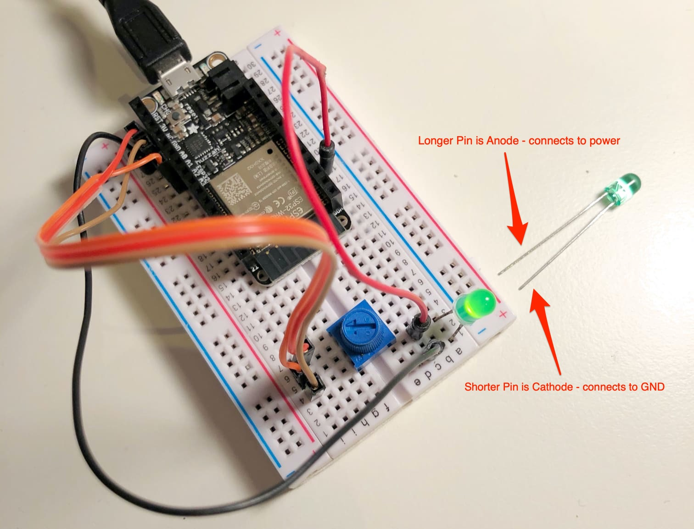

# PWM for an LED

PWM (Pulse Width Modulation) is used to create the effect of varying the amount of power to an output, for example to dim an LED.

## PWM Output Capable Pins
Orange Pins (**GPIO, not GPI**) 4, 5, 13, 14, 15, 16, 17, 18, 19, 25, 26, 27, 32, 33 (Pin 12 is not recommended)


Diagram: [Jon Froehlich](https://makeabilitylab.github.io/physcomp/esp32/esp32.html)

## Wiring

**Pins** - In this example, we're using Pin(32) for the LED output, and Pin(34) for the ADC (analog to digital) potentiometer input.

**LED** - Connect your LED Anode (the long one) to the Pin you select from the above, which will provide power. Also connect the cathode of the LED to ground.

**Potentiometer** - The potentiometer has three connections, signal in the middle pin, and power and ground for the two outside pins. Signal goes to the ADC pin were using. Power goes to 3V and ground goes to GND.





## Example code

This code reads the values from a potentiometer and maps that range (0-4095) to the allowed PWM range (0-1023).

[pwm.py](../examples/pwm.py)

```Python
from machine import Pin, PWM, ADC
import time

led = PWM(Pin(32), freq=5000) # create and configure

adc = ADC(Pin(34))
adc.atten(ADC.ATTN_11DB)

delay = 0.02

while True:
  value = int(adc.read() * 0.25) # convert range 0-4095 to 0-1023
  led.duty(value)
  print(value)
  time.sleep(delay)```
