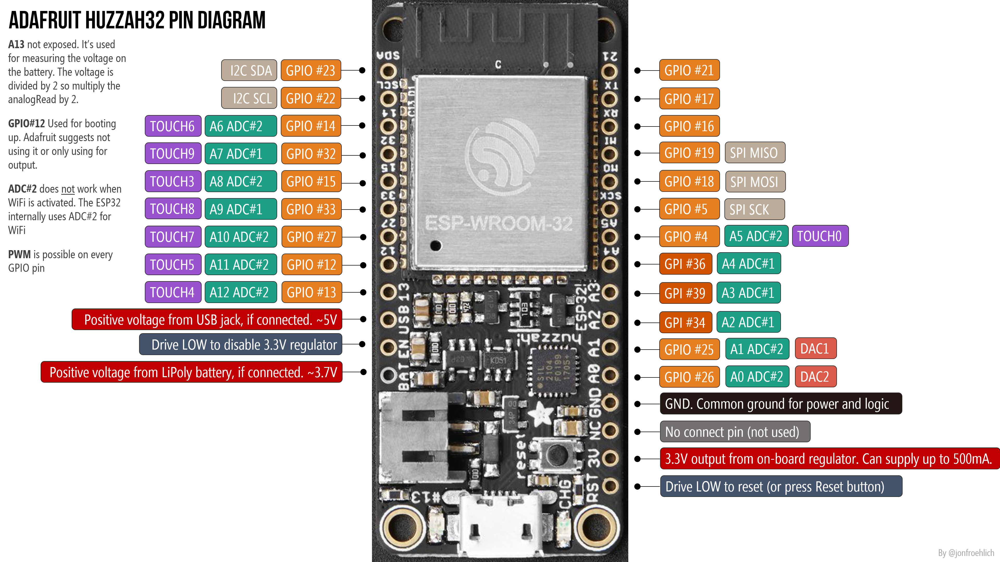

# Servos

Servos can be used with the ESP32 on any output ports that support PWM (pulse width modulation). The current version of Micropython for the ESP32 does not include direct support for servos, but you can use the PWM library to control them as discussed in the [ESP8266 Micropython documentation](https://docs.micropython.org/en/latest/esp8266/esp8266/tutorial/pwm.html#control-a-hobby-servo).

But there is a simple [Servo Python class definition](../examples/servo.py) originally by [Radomir Dopieralski](http://sheep.art.pl) that provides an easier interface for standard hobby servos.

### How To

-   **Download** - Get the [servo Python class from here](../examples/servo.py)
-   **Install Servo Library** - Use ampy to put the servo.py module on your device

<!-- -->

    ampy -p /dev/tty.SLAB_USBtoUART put servo.py

## PWM - Servo Output Capable Pins
Orange Pins (**GPIO, not GPI**) 4, 5, 13, 14, 15, 16, 17, 18, 19, 25, 26, 27, 32, 33 (Pin 12 is not recommended)



Diagram: [Jon Froehlich](https://makeabilitylab.github.io/physcomp/esp32/esp32.html)

## Wiring

**Pins** - In this example, we're using Pin(15) for the Servo output

**Servo** - Connect the servo in the following way
- **signal** control (typically yellow or white) to Pin(15) or your choice of output pin
- **power** to the 3V output
- **ground** to the GND


-   **External Power** - The ESP32 may not be able to properly power a full size servo (especially more than one at at time), so you may need to use an external power supply of 5 to 6 Volts (most hobby servos run on this). This can be [4 AA](https://www.adafruit.com/product/830) or [4 AAA](https://www.allelectronics.com/item/bh-44/battery-holder-4-aaa-cells/1.html?gclid=CjwKCAjw4sLVBRAlEiwASblR-_0YxFC1F8005xjriXw_vYbQ90sBTLn9MXfIM5p7ppEAEYIWInOkxhoC3_4QAvD_BwE) batteries, or a 3.3V LiPo with a [5V converter](https://www.adafruit.com/product/1903). The servo should connect to the power and ground of the battery, and the output pin on the ESP32.

- In addition, you **must connect the battery ground to the ESP32 ground**. This diagram shows this wiring approach for 2 servos connect to an Arduino, but it's the same approach for the ESP32.


### [servo_move.py](../examples/servo_move.py)

This simple example creates a servo object connected to Pin(15), then moves it from angle 15 to 165 and then to 90 with pauses in between each.

```Python
import time
import machine
from servo import Servo

servo_pin = machine.Pin(15)
my_servo = Servo(servo_pin)

my_servo.write_angle(15)
time.sleep(2)
my_servo.write_angle(165)
time.sleep(2)
my_servo.write_angle(90)
```

-   Note that each servo is different, and may not travel it's entire range with the default values of the Servo object. You can experiment by changing the min\_us and max\_us values when you create the Servo object if you use the fuller initialization arguments. See the servo.py module source code below, and [this page](http://techawarey.com/programming/micropython/servo-motor-control-using-micropython/) for more details.

<!-- -->

    '''
    Args:
            pin (machine.Pin): The pin where servo is connected. Must support PWM.
            freq (int): The frequency of the signal, in hertz.
            min_us (int): The minimum signal length supported by the servo.
            max_us (int): The maximum signal length supported by the servo.
            angle (int): The angle between the minimum and maximum positions.
    '''
    my_servo = Servo(servo_pin, 50, 600, 2400, 180)

### [servo_cycle.py](../examples/servo_cycle.py)

This example uses a for loop to move a servo back and forth from 15 degree to 165 degrees.

```Python
import time
import machine
from servo import Servo

servo_pin = machine.Pin(15)
my_servo = Servo(servo_pin)
delay = 0.01
min = 15
max = 165

while True:
    for i in range(min,max):
      my_servo.write_angle(i)
      time.sleep(delay)
    for i in range(max, min, -1):
      my_servo.write_angle(i)
      time.sleep(delay)
  ```
