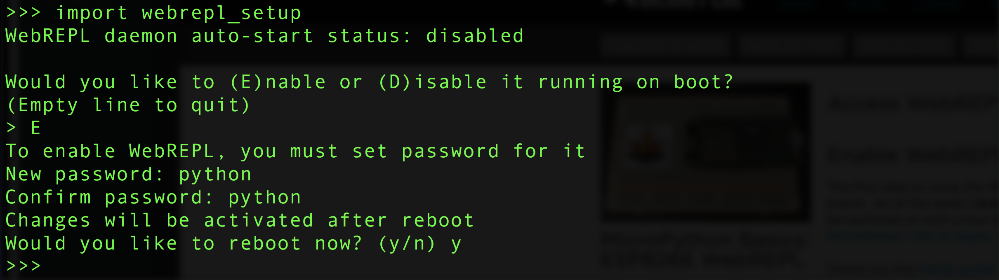
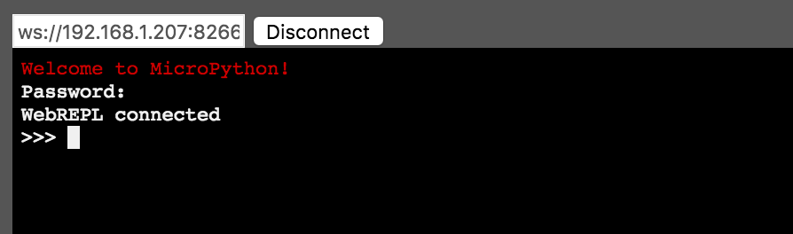

## Setting up WebREPL

The normal methods for sending files and accessing the ESP32 REPL are kind of a pain and require using the Terminal with the AMPY and SCREEN commands. Instead of using the Terminal, it is possible to do both from within a web browser page.

For this approach to work, you MUST have already setup [WiFi](usingwifi.md) with your boot.py file.

Bookmark the following page so you can easily access it in the future:

[http://micropython.org/webrepl/](http://micropython.org/webrepl/)

For this to work, you need to do some setup on your ESP32 in MicroPython:



1. Get to the ESP32 REPL (>>>)
1. At the >>> prompt, type in ```import webrepl_setup```
1. In the prompt you see, Enable webrepl, and set your Password
1. Get the IP address of your ESP32 by typing in the >>> REPL ```boot.showip()```
1. Copy the IP address and insert it into the ws:// window in the browser interface. For example, if your ESP32 IP address were 192.168.1.36 you would put in ws://192.168.1.36:8266/
1. After setting the IP address, click on the CONNECT button. The interface will ask for your password: type it in (you won't see anything as you type), then hit return.
1. Once you've gotten properly connected, the REPL >>> prompt will appear
1. On the top right side of the browser is the interface for sending and getting files from the ESP32.



For more information on WebREPL, see the following:

- https://docs.micropython.org/en/latest/esp8266/tutorial/repl.html#webrepl-a-prompt-over-wifi
- https://learn.adafruit.com/micropython-basics-esp8266-webrepl/access-webrepl
