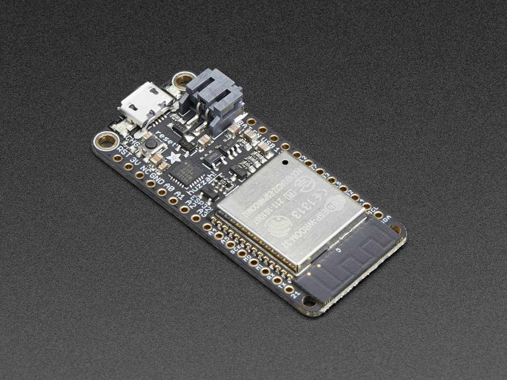

# Getting Started Guide for the ESP32

This is a get started guide for the ESP32 using [Micropython](https://docs.micropython.org/en/latest/esp8266/index.html). In the future, [Arduino Core](https://github.com/espressif/arduino-esp32) and [CircuitPython](https://learn.adafruit.com/welcome-to-circuitpython/what-is-circuitpython) (if Adafruit adds ESP32 support) info may be added. This chip is a great improvement on the already useful ESP8266, adding much more IO, and supporting both WiFi and Bluetooth.

Everything has been testing using the [Adafruit Huzzah32](https://www.adafruit.com/product/3405), but should work on other implementations of the ESP32 (and most of this should also work on the ESP8266).

1. [Set up your computer and ESP32](docs/setup.md)
1. [Using Python with Sensors and Actuators](docs/basics.md)
1. [Using WiFi](docs/usingwifi.md)
1. [ESP32 Using io.adafruit.com Cloud IoT Service](docs/io-adafruit.md)
1. [Using Servos](docs/servo.md)
1. [Multitasking in Micropython with \_threads](docs/multitasking.md)

